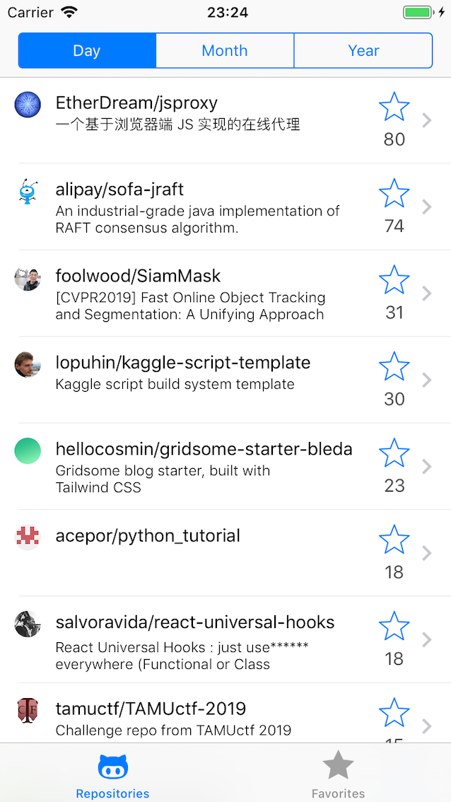
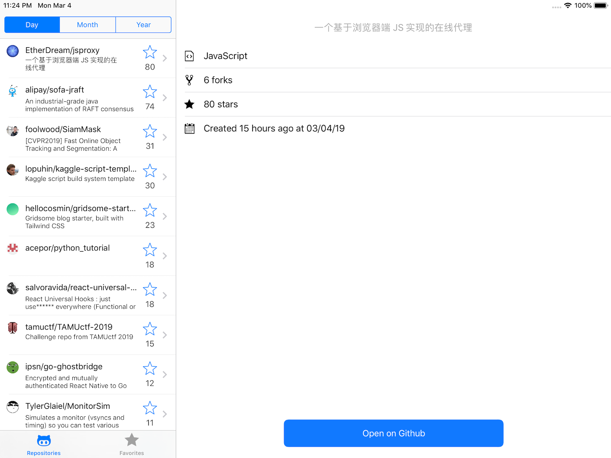

# Stanwood iOS assignment
## Trending Repositories App
An iOS application that displays the most trending repositories on GitHub.

### Requirements

Swift `4.2`, iOS deployment target: `12.1`.

Cocoapods `1.6.0`.

### Setup
Installed pods are included in the repository. Project runs out of the box.
In case of manual pods installation, run:

```
pod repo update
pod install
```

### Supports iPhone and iPad devices
iPhone | iPad
--- | ---
 | 

# Covering notes

## General architecture of the application

Stuck to `MVP` as a general architecture. This is a recognizable and commonly used pattern. `MVP` provides shared responsibility, and good testability. As a disadvantage, it requires more code writing.  
   
Avoided using `VIPER` because of lots of boilerplate code requirement.  
Avoided using `MVVM` because of data bindings requirement. Bindings require reactive behavior which can be achieved by external libraries like `RxSwift` and others.  
`Monster View Controller` is not considered.

`Stanwood` project and module templates are considered and reviewed, but not used because of my poor familiarity and lack of documentation.

The app consists of several main modules:

- `FetchRepos` - Implements repository list with Github API query functionality.
- `FavoriteRepos` - Implements persisted favorite repositories list.
- `RepoDetailedView` - Implements particular repository details presentation.
- `RootTabController` - Implements root container for repository lists and handles creation period filter selection.

A set of interfaces is introduced for each module. Module parts implement said interfaces and interact basing on declared protocols. Such approach determines and shares responsibility between module parts.  
Generally a module consists of view and presenter.  
View implements `ViewInput` interface. View displays data and delivers user interactions to presenter
Presenter implements `ModuleInput` and `ViewOutput` interfaces. Presenter handles user interactions, controls view and performs logical operations.

Other entities: 
 
- `AppAssembly` - Initializes module parts and perform all parts assignment.
- `AppCoordinator` - Initializes application's UI stack and performs navigation.
- `NetworkingTransport` - Networking core based on URLSession. Implements base network requests for further usage by services.

## Technical choices

### Dependency management
`Cocoapods` used as dependency manager. All pods are included to project repository for building convenience.  
`Carthage` might be used as alternative.

### Dependencies

- `StanwoodCore` - library with useful utilities. Used as suggested.
- `SwiftLint` - forces code style and conformance to conventions. Helps to keep code clean.
- `Kingfisher` - library produces convenient way to download images and implements caching.
- `RealmSwift` - cross platform database framework with handy API.
- `Connectivity` - network reachability utils with new Network Framework integration.
- `SwiftEntryKit` - library for displaying various notifications. Used for network status panel implementation.

### Interface versatility

Used `UISplitViewController` as root container to support both phone and tabled devices as required by task. The app displays list of objects and object details on separate containers. UISplitViewController covers such functionality and works both on iPhones and iPads.

### Models and data persistence

Repositories are represented by two types of models:  
 - `RepositoryPlain` - the plain models for fetched repositories list.  
- `RepositoryRealm` - data base models for favorite repositories list.  
Plain models, are implemented as `Codable` structs. `Decodable` protocol is implemented to perform mappings from json API response.  
Persistence can be achieved by `Codable` serialization and storing serialized objects on device or in `UserDefaults`. But such approach is not suitable for logical data storage like lists of objects. Therefore the `Realm` database was brought in.


###### Note:
`FetchRepo` list displays list of plain models, but `FavoriteRepos` list displays values based on realm objects, which is not best solution. The better approach will be to save response object to data base and populate both lists basing on realm object values.
To keep things tidier, `Repository` protocol was introduced. Both realm and plain models implement the said protocol a list could consume objects regardless of their type.

### Pagination

API pagination is implemented for `FetchRepos` list. `UICollectionViewDataSourcePrefetching` protocol implementation is used. Upcoming collection view cells call corresponding datasource method and trigger further pages loading.

## Features not implemented

### Some features are not implemented due to lack of time:

- Search for both lists - Might be implemented with `UISearchController`, Github API filtering and Realm filtering. Repository `search by text` predicate is implemented for Realm, but not used.
- Swipe cell to delete favorite repository - swipe cell behavior is not supported natively for collection views.
- Languages set in repository details - managed to display only main language of repository instead. Languages set and percentages are accessible by distinct url. That requires an additional request to perform for each repo. 
- Proper auth token storage - In scope of test task just hardcoded Github API token placeholder. Used personal token during development. The empty placeholder is pushed to Github. In general case the token is acquired during auth process and stored in keychain.
- Localizations - omitted localizations in scope of test task.
- Persisted repositories refresh - Persisted repositories stay as is even after `FetchRepos` list refreshes data. They may be refreshed only by re-adding.
- `incompleteResults` property of Github search API response is not handled.
- Rate limit hit not handled.
- iOS deployment target wasn't downgraded to `11`.
- Data base objects recursive deletion - By default, `Realm` doesn't implement recursive deletions. In test task scope, relationship objects were deleted manually. For production projects generic approach should be used.

### Libs usage suggested:

- `SwiftGen` - Generates constants from strings, colors, images, storyboards, etc...
- `Fastlane` - Modern deployment tool, which can be used both manually and by CI.
- `OSLog` - Provides logging divided to levels and types. Doesn't affect performance.